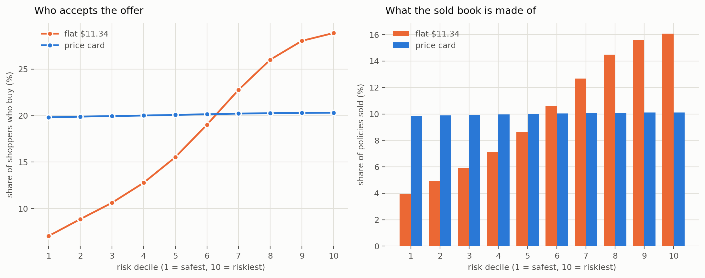

# Predicting e-commerce returns, and pricing coverage against them

**Price each order to its own risk and you earn the same margin as a flat rate while quoting most shoppers less.** At a 10% return rate a single flat rate is $2.76 for everyone; priced to risk the range is $1.47 to $8.92, and **eight in ten shoppers pay less than the flat rate would charge them**. Both earn exactly the target margin, because the rule hits its target on every individual order rather than on the average.

An order-level return-prediction model on 2.3M real order lines, and the pricing rule it produces.

📄 **[Memo (PDF)](memo/returns_ml_memo.pdf)** — the short version, with the charts. Source is [`memo/returns_ml_memo.html`](memo/returns_ml_memo.html); edit it and run `python memo/build_memo.py` to re-render.

## Key results

| | |
|---|---|
| **Model** | 0.8526 AUC (vs 0.7959 raw-attribute baseline), log loss 0.4527 |
| **Calibration** | ECE 0.0047 — top decile predicts 0.993 against actual 0.994 |
| **Model choice is irrelevant** | XGBoost 0.8528, LightGBM 0.8526, predictions correlate 0.998 |
| **Features carry it** | Logistic regression reaches 0.8348 — within 0.018 of the boosters |
| **Strongest single signal** | Same article ordered in 2+ sizes → **96%** return rate vs 54% |
| **Pricing (measured)** | Same margin as a flat rate, with 5–8 of 10 shoppers quoted less |
| **Selection effect (modelled)** | Buyers go from +0.123 riskier than the population to +0.002 |

## The pricing rule

```
price = (probability of return × cost of a return) ÷ (1 − margin)
```

Because the probability is calibrated, this earns the target margin **on every single order** — no optimiser, and **no assumption about shopper behaviour**. At $8 per return, on this book:

| Risk decile | Return probability | Expected claim | Price at 45% | Price at 60% |
|---|---|---|---|---|
| 1 (safest) | 0.15 | $1.89 | **$3.44** | $4.73 |
| 5 | 0.60 | $5.09 | $9.25 | $12.72 |
| 10 (riskiest) | 0.99 | $7.95 | **$14.45** | $19.87 |

One flat rate earning the same 45% is **$9.73** for everyone. Both earn exactly 45%; the difference is who pays what.

### The same rule at healthier return rates

| Return rate | Flat rate for everyone | Risk-priced range | Shoppers paying less than flat |
|---|---|---|---|
| **10%** | $2.76 | $1.47 – $8.92 | **8 in 10** |
| 20% | $4.07 | $1.53 – $12.28 | 7 in 10 |
| 30% | $5.38 | $1.66 – $13.58 | 6 in 10 |
| 63% (this book) | $9.73 | $3.44 – $14.45 | 5 in 10 |

The healthier the merchant, the more customers are better off. A **$100M book of coverage returns $45M of contribution at a 45% margin** at every one of these rates, because each policy carries the target margin regardless of who buys.

## What is measured and what is modelled

This distinction is load-bearing, so the repo keeps it explicit.

**Measured** — every return outcome, all model results, the claim costs derived from them, and every price above. These come from 738,698 real orders with actual return labels.

**Modelled** — who opts in at a given price. No public dataset contains take-up behaviour, so notebook 15 introduces a demand curve anchored at 35% of shoppers buying at $5, clearly separated by a divider. Under it, adverse selection nearly vanishes: buyers go from **+0.123 riskier** than the population to **+0.002**, and servicing a policy gets 14% cheaper. The direction is defensible; the magnitude is a guess until measured against real take-up.



## How it works

**Data.** Data Mining Cup 2016 — 2,325,165 order lines from an anonymized European fashion retailer (Jan 2014 – Sep 2015), collapsed to 738,698 orders labeled `any_return`. Picked over Olist or H&M because it has a **real return label**, not a review-score proxy. This book returns 63.5% of orders, the global high-water mark, which is why every price is also run at gentler rates.

**Leakage discipline.** Validation is a **time split** at 2015-07-01, not random K-fold. Every history feature is past-only via `src.features.past_rate`, which freezes each key's history at the start of the day so an order never sees itself or its same-day siblings — verified against a hand-checked example including a same-day tie.

**Models.** One fixed, untuned LightGBM throughout, with logistic regression and XGBoost as reference points. The study varies the data, not the hyperparameters.

## Repository

```
notebooks/     run in order
  01           download DMC 2016 order lines into data/raw
  02           auto-EDA profile of the raw order lines
  03           order table and raw-attribute baseline
  04           basket features: bracketing, discount depth, mix
  05           customer history features (past-only)
  06           article / size / product-group rates (past-only)
  07           model: LightGBM, reliability diagram, precision@k
  08           pricing: sweep, strategies, adverse selection
  09           break-even frontier over return rate
  10           segment analysis: where the model wins and breaks
  11           interpretation: SHAP and permutation importance
  12           manual EDA: the four cuts, clustering, class separation
  13           logistic regression: what moves the needle, in odds ratios
  14           XGBoost: is the score model-limited or data-limited?
  15           the price card: measured pricing first, modelled demand after
  16           further exploration: a heterogeneous multi-merchant portfolio
src/           data paths, past-only rates, time-split and OOF helpers
figures/       charts used in the memo and this README
memo/          memo (editable HTML source + PDF + build script)
data/          raw data and local outputs (gitignored)
eda/           generated auto-EDA reports (gitignored)
```

Every code cell across all 16 notebooks carries explanatory markdown above it.

## Getting started

```bash
# 1. create and activate the conda environment (Python 3.11 + the data stack)
conda env create -f environment.yml
conda activate returns-ml

# 2. register the Jupyter kernel (so it is selectable in Jupyter / VS Code)
python -m ipykernel install --user --name returns-ml \
  --display-name "Python (returns-ml)"
```

Run `notebooks/01_download.ipynb` to fetch the data into `data/raw/` (not committed), then run the notebooks in order. A pip `requirements.txt` is provided as an alternative to conda.

## Honest limitations

- **Take-up is assumed, not measured.** The dataset has no opt-in data. The price card does not depend on it; every attach, revenue and selection figure does.
- **63.5% is an outlier return rate.** US brands run 15–30%, which is why notebooks 09 and 15 sweep the rate rather than reporting one number.
- **Margin here is gross margin on revenue**, `(price − cost)/price`. Markup on cost gives lower prices for the same headline percentage.
- **The top of the range is optically large.** $19.87 on a $106 order is ~19% of cart value at the 60% target.
- **Two payment segments show calibration drift** past 0.04 ECE and would need per-segment recalibration before their prices could be trusted.
- Amounts shown in dollars; the source retailer is euro-denominated, treated 1:1 with no FX applied.

## References

- **Dataset**: Data Mining Cup 2016 (prudsys AG), mirrored in [ISU-DMC/dmc2016](https://github.com/ISU-DMC/dmc2016). Downloaded at runtime, never committed.
